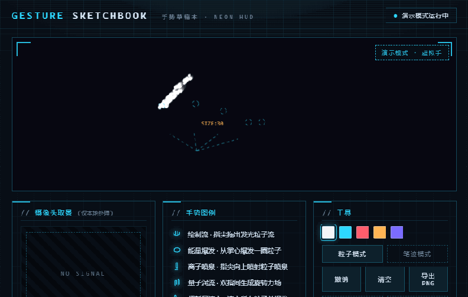
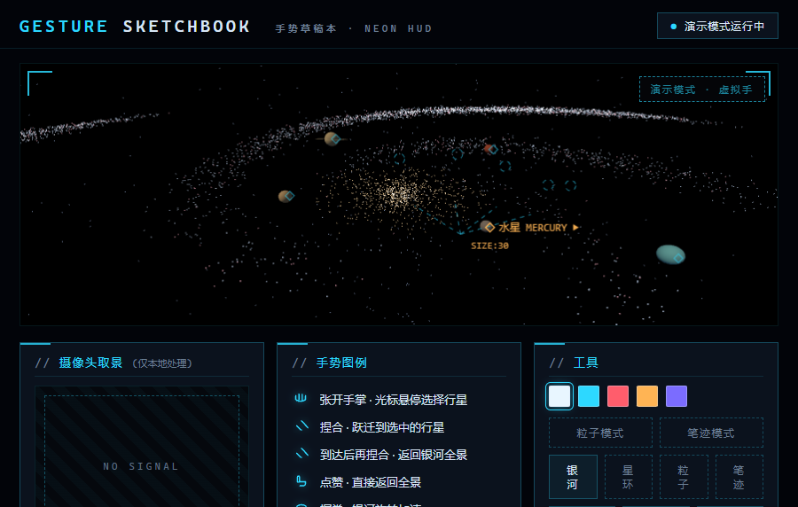
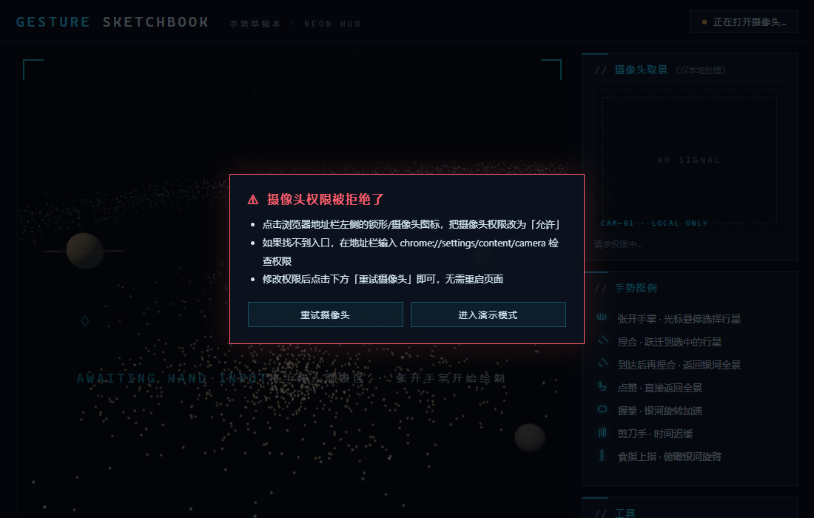

# 手势草稿本 · Gesture Sketchbook

用摄像头手势驱动的实时交互粒子 Web 应用,四种视觉模式:**银河星旅**(Three.js,纯黑沉浸背景)、**3D 星环**、**粒子**(花开可拿摄像头人脸当背景)、**笔迹**。移动手掌选中行星,捏合跃迁过去;挥动手掌,星环随你加速旋转。深空底色 + 青色 HUD,科技感拉满。



银河星旅(跃迁到行星)与摄像头异常处理:





## 在线演示

打开即玩(需要允许摄像头权限,或点击"演示模式"无摄像头体验):

**[打开在线演示 → https://mayuhan78855.github.io/gesture-sketchbook/](https://mayuhan78855.github.io/gesture-sketchbook/)**

两个体验也有独立网址,方便单独分享:

- 🌸 **花朵粒子页**(全屏沉浸:摄像头人脸背景,张手花开/握拳消散,只有一种花):<https://mayuhan78855.github.io/gesture-sketchbook/flower/>
- 🌌 **银河星旅页**(全屏沉浸:纯黑银河 + 七大行星本色 + 捏合跃迁):<https://mayuhan78855.github.io/gesture-sketchbook/galaxy/>

## 手势说明

默认是 **银河星旅模式**(Three.js:银河系 + 七大行星),侧栏可切换 **3D 星环 / 粒子 / 笔迹**:

| 手势 | 动作 | 银河星旅 | 3D 星环 | 粒子模式 | 笔迹模式 |
|------|------|---------|---------|---------|---------|
| 🖐 张开手掌 | 面向镜头移动 | 光标悬停选择行星 | 视角跟随,挥动加速旋转 | 指尖拖出发光粒子流 | 用食指尖绘制霓虹笔迹 |
| ✊ 握拳 | 保持 3 帧 | 银河旋转加速 | 星环收缩加速 | 从掌心爆发一圈粒子 | 切换画笔颜色 |
| ☝ 食指上指 | 只伸食指 | 俯瞰银河旋臂 | 切换俯瞰视角 | 指尖向上喷射离子喷泉 | 打开/关闭构造线 |
| ✌ 剪刀手 | 伸出食指+中指 | 时间迟缓 | 星环分裂成内外双环 | 双指间生成量子涡流 | 切换笔刷粗细 |
| 👍 点赞 | 竖起拇指 | 返回银河全景 | 超新星爆开重组 | 超新星爆发并清空粒子 | 清空画布 |
| 🤏 捏合 | 拇指食指捏在一起 | 跃迁到选中行星;到达后再捏合返回 | 万千粒子聚合成星球 | 聚合成一朵缓缓绽放的花,松开消散 | 撤销上一笔 |

除了手势,**动作本身也有效**:快速挥动手掌会带起粒子/加速星环(掌风气流)。

键盘快捷键:`1-5` 选颜色 · `C` 构造线(笔迹模式) · `Ctrl+Z` 撤销 · `Ctrl+S` 导出 PNG。

## 快速开始(3 步)

1. **安装 Node.js**(LTS 版本即可):https://nodejs.org/zh-cn ,安装后在命令行输入 `node -v` 能看到版本号就成功。
2. **下载项目并进入目录**:
   ```bash
   git clone https://github.com/mayuhan78855/gesture-sketchbook.git
   cd gesture-sketchbook
   ```
   (不会用 git 的话,在 GitHub 页面点绿色 Code 按钮 → Download ZIP 解压也可以)
3. **启动本地服务器并打开页面**:
   ```bash
   node scripts/serve.js
   ```
   浏览器打开 <http://localhost:8000>,允许摄像头权限,把手伸到镜头前。

> ⚠️ 摄像头权限只在 `https` 或 `localhost` 下可用,所以**必须**通过上面的本地服务器打开,直接双击 index.html 是用不了摄像头的。没有 Node 也可以用 Python:`python -m http.server 8000`。
>
> 💡 没有摄像头?点页面里的"演示模式",会有一只虚拟手演示全部交互。

## 技术栈

- **原生 HTML / CSS / JavaScript**--没有框架、没有构建步骤,适合初学者逐行阅读
- **Three.js**——3D 模式（银河星旅 / 星环）的 WebGL 渲染
- **MediaPipe Tasks Vision（GestureRecognizer）**——Google 开源的浏览器端手势识别，21 个手部关键点 + 手势分类，全部在浏览器本地推理；**模型与 wasm 已随仓库本地化（vendor/ 目录），无需访问 Google 服务**
- **Canvas 2D**--粒子/笔迹渲染、HUD 构造线绘制

## 隐私说明

- 摄像头画面**只在本机浏览器内处理**，不会上传到任何服务器；粒子模式下它同时作为绘制背景实时显示，同样不出本机。
- 手势识别模型已随仓库本地化（vendor/ 目录），断网也能用（演示模式与三大 3D/粒子体验均离线可玩）。
- 代码中不存在把视频帧发送到远程接口的调用;唯一的网络请求是首次打开时从 CDN 下载识别模型(约 8MB),之后浏览器会缓存。
- 关闭页面即停止摄像头,可随时在浏览器地址栏撤销授权。

## 代码结构

| 文件 | 职责 |
|------|------|
| `index.html` | 页面结构:画布、取景框、手势图例、工具栏 |
| `css/style.css` | HUD 科技感视觉风格(深空底、青色霓虹、扫描线、取景框、等宽读数) |
| `js/config.js` | **所有可调参数**:颜色、笔刷、平滑、阈值--改这里就能定制 |
| `js/gestures.js` | 摄像头 + MediaPipe 识别循环 + 平滑/防抖 |
| `js/sketch.js` | 绘画引擎:笔迹、构造线、撤销、导出 |
| `js/galaxy.js` | 银河星旅:螺旋星系背景、七大行星、光标选择与跃迁 |
| `js/space3d.js` | 3D 星环模式:Three.js 粒子云 + 相机/聚合/分裂 |
| `js/particles.js` | 粒子引擎:粒子池、引力点/涡流力场、辉光拖影渲染 |
| `js/effects.js` | **手势→粒子效果注册表(加新效果改这里)** |
| `js/demo.js` | 演示模式:虚拟手按时间轴驱动同一套数据流 |
| `js/app.js` | 入口:双模式切换 + 把"识别结果"翻译成"交互动作" |
| `scripts/serve.js` | 本地静态服务器 |
| `tests/check.mjs` | 自动化验收测试(13 项) |
| `tests/soak.mjs` | 5 分钟稳定性测试 |

## 想自己改点东西?

看 [docs/学习路线.md](docs/学习路线.md)--面向零基础的陪跑教程,最后一章有"毕业任务":改一个参数、提交代码、推上 GitHub。所有参数集中在 `js/config.js`,改完保存、刷新页面即可生效。

遇到问题先看 [docs/故障排查.md](docs/故障排查.md)。

## 扩展:添加你自己的手势效果

项目特意把"手势 → 粒子行为"做成了注册表(`js/effects.js`),加一个新效果只要 3 步:

1. 在 `EFFECTS` 里加一个条目,键名用 MediaPipe 的手势名(可用:`Open_Palm` / `Closed_Fist` / `Pointing_Up` / `Victory` / `Thumb_Up` / `Thumb_Down` / `ILoveYou` / `Thumb_Index`)。
2. 按需写 `onEnter`(触发瞬间)/ `onFrame`(持续期间)/ `onExit`(松开瞬间)三个钩子,用 `ps.spawn()` / `ps.burst()` 生成粒子。
3. 保存刷新--侧栏图例自动更新,其他文件一行都不用改。

`js/effects.js` 文件头有更完整的参数说明。

## 开发与测试

```bash
npm install        # 安装测试依赖(只需一次)
npm test           # 自动化验收测试(需要本机装有 Edge)
node tests/soak.mjs # 5 分钟稳定性测试
```

## License

[MIT](LICENSE)
