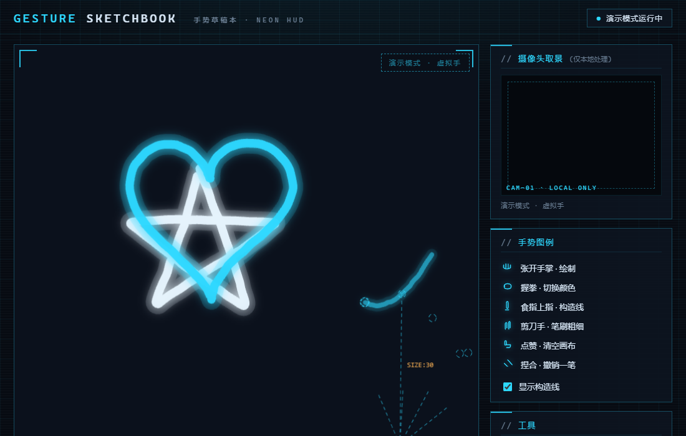

# 手势草稿本 · Gesture Sketchbook

用摄像头手势在"草稿纸"上作画的 Web 应用。张开手掌 = 画笔,握拳 = 换颜色,点赞 = 清空画布--不需要任何外设,一个浏览器就够。


构造线模式(手部骨架以虚线画在纸上)与摄像头异常处理:




## 在线演示

打开即玩（需要允许摄像头权限，或点击“演示模式”无摄像头体验）：

**[打开在线演示 → https://mayuhan78855.github.io/gesture-sketchbook/](https://mayuhan78855.github.io/gesture-sketchbook/)**

## 手势说明

| 手势 | 动作 | 效果 |
|------|------|------|
| 🖐 张开手掌 | 手掌面向镜头移动 | 用食指尖绘制铅笔笔迹 |
| ✊ 握拳 | 保持 3 帧 | 切换画笔颜色 |
| ☝ 食指上指 | 只伸食指 | 打开/关闭构造线(虚线骨架) |
| ✌ 剪刀手 | 伸出食指+中指 | 切换笔刷粗细(自动/细/粗) |
| 👍 点赞 | 竖起拇指 | 清空画布 |
| 🤏 捏合 | 拇指食指捏在一起 | 撤销上一笔 |

键盘快捷键:`1-5` 选颜色 · `C` 构造线 · `Ctrl+Z` 撤销 · `Ctrl+S` 导出 PNG。

## 快速开始(3 步)

1. **安装 Node.js**(LTS 版本即可):https://nodejs.org/zh-cn ,安装后在命令行输入 `node -v` 能看到版本号就成功。
2. **下载项目并进入目录**:
   ```bash
   git clone https://github.com/mayuhan78855/gesture-sketchbook.git
   cd gesture-sketchbook
   ```
   (不会用 git 的话,在 GitHub 页面点绿色 Code 按钮 → Download ZIP 解压也可以)
3. **启动本地服务器并打开页面**:
   ```bash
   node scripts/serve.js
   ```
   浏览器打开 <http://localhost:8000>,允许摄像头权限,把手伸到镜头前。

> ⚠️ 摄像头权限只在 `https` 或 `localhost` 下可用,所以**必须**通过上面的本地服务器打开,直接双击 index.html 是用不了摄像头的。没有 Node 也可以用 Python:`python -m http.server 8000`。
>
> 💡 没有摄像头?点页面里的"演示模式",会有一只虚拟手演示全部交互。

## 技术栈

- **原生 HTML / CSS / JavaScript**--没有框架、没有构建步骤,适合初学者逐行阅读
- **MediaPipe Tasks Vision(GestureRecognizer)**--Google 开源的浏览器端手势识别,21 个手部关键点 + 手势分类,全部在浏览器本地推理
- **Canvas 2D**--笔迹渲染、手绘抖动、构造线绘制

## 隐私说明

- 摄像头画面**只在本机浏览器内处理**,不会上传到任何服务器。
- 代码中不存在把视频帧发送到远程接口的调用;唯一的网络请求是首次打开时从 CDN 下载识别模型(约 8MB),之后浏览器会缓存。
- 关闭页面即停止摄像头,可随时在浏览器地址栏撤销授权。

## 代码结构

| 文件 | 职责 |
|------|------|
| `index.html` | 页面结构:画布、取景框、手势图例、工具栏 |
| `css/style.css` | 手绘构造线视觉风格(纸面、虚线、手写体、粗边框) |
| `js/config.js` | **所有可调参数**:颜色、笔刷、平滑、阈值--改这里就能定制 |
| `js/gestures.js` | 摄像头 + MediaPipe 识别循环 + 平滑/防抖 |
| `js/sketch.js` | 绘画引擎:笔迹、构造线、撤销、导出 |
| `js/demo.js` | 演示模式:虚拟手按时间轴驱动同一套数据流 |
| `js/app.js` | 入口:把"识别结果"翻译成"交互动作" |
| `scripts/serve.js` | 本地静态服务器 |
| `tests/check.mjs` | 自动化验收测试(13 项) |
| `tests/soak.mjs` | 5 分钟稳定性测试 |

## 想自己改点东西?

看 [docs/学习路线.md](docs/学习路线.md)--面向零基础的陪跑教程,最后一章有"毕业任务":改一个参数、提交代码、推上 GitHub。所有参数集中在 `js/config.js`,改完保存、刷新页面即可生效。

遇到问题先看 [docs/故障排查.md](docs/故障排查.md)。

## 开发与测试

```bash
npm install        # 安装测试依赖(只需一次)
npm test           # 自动化验收测试(需要本机装有 Edge)
node tests/soak.mjs # 5 分钟稳定性测试
```

## License

[MIT](LICENSE)
